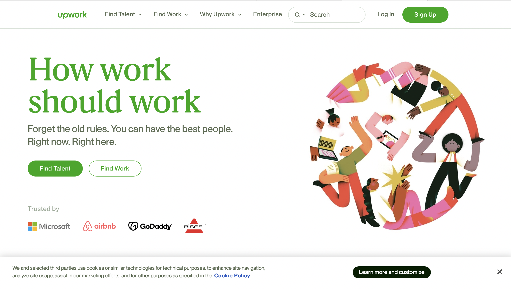

# Kirish

Siz freelancing sohasida ishlamoqchimisiz?
Uyingizdan chiqmasdan internet orqali Xalqaro kompaniyalarda ishlashni xohlaysizmi?
Buning ortidan mo'maygina daromad topishnichi?

Unda ushbu kurs aynan siz uchun. Kurs davomida siz _xalqaro maydonda katta obro'ga ega bo'lgan_, _juda tez sur'atda o'sib takomillashib borayotgan_ Freelanserlik sohasining sir-asrorlarini o'rganasiz. Bu kurs davomida o'rganadigan bilimlaringiz frilanserlikni boshlashda va muvaffaqiyatli frilanser bo'lishingizda yordam beradi.

Kursni tamomlaganingizda _Upwork_ da frilanser sifatida ish boshlashingiz mumkin.

## Muallif haqida

Ismim Sabohat. Dasturlashga ilk bor Xalqaro Vestminster Universitetiga o'qishga qabul qilinganimda qadam qoyganman. Va 3 yil davomida dasturlashni muntazam o'rganganman. Ha, 3 yil muntazam o'qish. Aynan shu vaqt mobaynida O'zbek, Rus, Belorus va Ukraina millatiga mansub insonlardan to'g'ridan to'g'ri, qolaversa YouTube, Udemy va shunga platformalar orqali Ingliz va Hind dasturchilarining video-darslarini ko'rib o'rganganman. O'rganish hali ham nihoyasiga yetgani yo'q. Hozirgi kunlarda [Upwork](https://upwork.com) platformasida Top Rated Freelancer va [Barq](https://barqapp.com) kompaniyasida dasturchi sifatida ishlab kelmoqdaman.

Bundan tashqari [YouTube kanalim](https://www.youtube.com/channel/UCbI_6MNsSe7uWTD6-xKItoQ) va [Telegram kanalim](https://t.me/easy_freelancing) orqali yuzlab insonlarga bilganlarimni ulashib kelmoqdaman.

O'ylaymanki, hozirda ixtiyoringizda bo'lgan o'quv qo'llanmasi innovatsiyalar olamiga qadam qoyishingizga ko'makchi bo'ladi. Ushbu kurs orqali sizlarga [Upwork](https://www.upwork.com)da to'plagan tajribam va bilimimni ulashishni niyat qildim.

## Kursda nimalar o'rgatiladi

Soha: Frilanserlik

Platforma: Upwork

## Frilanserning odatiy ish kuni

Frilanserlar xilma-xil pozitsiyalarda ish olib borishadi. Bu o'z ichiga dasturlash (Backend, Frontend), dizaynerlik, SMM, copy-writing, data-entry (ma'lumotlar kiritish), project managerlik va boshqa ko'plab sohalarni qamrab oladi. Sizning sohangizdan qat'iy nazar, Upworda sizga mos ish topilishi ehtimoli juda katta.

Men dasturlashning Frontend yo'nalishimda Frilanser bo'lib ishlashimni hisobga olib, o'zimning misolimda ushbu soha vakilining odatiy kun tartibi haqida gaplashib olamiz.

_Ertalab 9:00 da ish boshlayman, 13:00 dan 14:00 gacha tushlik va keyin 18:00gacha ishlayman._

**Aslida esa bunday emas! Frilanserlik sizga ko'plab qulayliklar beradi, shu jumladan o'z kun tartibingizni o'zingiz xohlaganingizdek belgilaysiz.**

Men ertalab soat 10 da Upworkda ish boshlayman (uydan turib). Birinchi bo'lib mijozlarim bilan gaplashaman va bajarilgan ishlar haqida ma'lumot beraman (har kuni emas, kunora). Bajaradigan vazifalarim turlicha, shu sababli hech ham zerikib qolmayman. Proyektlar va men ishlaydigan mijozlar tez o'zgarib turadi (Upworkda bir vaqtning o'zida 1-2ta proyektda ishlash mumkin, va proyekt tugagach ko'p hollarda boshqa mijozlar bilan boshqa proyektlarda ish boshlanadi).

Soat 12-13:00 atrofida tushlik qilib ishimni davom ettiraman. Va yana 2 soat ishlagach, ko'p hollarda boshqa mashg'ulotlar bilan band bo'laman.

Universitetda darsim bor kunlarda esa Upwork uchun kechki payt 2-3 soat ajrataman. Ish tartibi va ish miqdori o'zgarib turadi, ba'zi kunlarda kamroq, ba'zan ko'proq soat Upworkga ajrataman.

Ishlash jarayonida qiyinchilikga duch kelib qolganimda Google/Stackoverflow va guruhdagi boshqa dasturchilardan maslahat so'rayman. Ish tanlashda mijozga katta e'tibor qarataman va bu ish bir zaylda, qiyinchiliklarsiz davom etishini taminlaydi.

Ko'rib turganingizdek, oz vaqt ishlasamda, soatlik maosh kattaligi sababli yahshi oylik olaman. Aslida, oylik emas "Haftalik" chunki Upwork har haftada yig'gan pullaringizni sizga beradi.

## Kurs oxirida qanday natija kutiladi

Kursni muvaffaqiyatli tamomlaganingizda Upwork platformasida o'z bilimingiz va tajribangizdan foydalanib daromad qilishingiz mumkin bo'ladi. Agar kursning har bir bo'limida o'rgatiladigan mavzularni puxta o'zlashtirib berilgan vazifalarni to'liq bajara olsangiz Upworkda "Rising Talent" darajasini va birinchi ishingizni olishingiz mumkin.

Nima bo'lgan taqdirda ham, ushbu safarni boshlayotgan ekansiz o'z yo'lingizni topib olguningizgacha qo'ldan kelgan yordamni ko'rsatishga harakat qilaman.

Kurs asosiy 3 ta qismdan iborat. Bular:

1. Upworkda ajralib turadigan Profil yaratish.

2. Ish qidirish.

3. Mijoz bilan muomala qilish sirlari.

4. Bonus: pul masalasi va Upwork lifehacklari.

<!-- ## Maslahatlar

**Frilanserlik haqida to'g'ri taasurotga ega bo'ling**

Ko'pchilik frilanser deganda minglab dollarlik maosh xayoliga keladi. Ammo, bu to'liq emas, to'laqonli taasurotga ega bo'lish uchun yana bir necha komponentlarni qo'shish kerak.

Bularning har biri ikkinchisiga asos bo'lib xizmat qiladi. Har qanday innovatsiya qilish uchun yillar davomida mehnat qilish kerak bo'ladi. Aksariyat hollarda, mehnat tekingga qilasiz. Facebook, Instagram yoki shunga o'xshagan biror bir dastur yo'qki ularning dunyoga taqdim qilgan insonlar ma'lum bir vaqt tekinga ishlashmagan bo'lishsa.

Demak, sabrning o'rnini tushunib yetgan bo'lsak, endi shu sabrni yoqilg'isi bo'lmish _xolis niyat_ haqida gaplashsak. Agar sizda niyatingiz o'zingizdan kattaroq bo'lmasa, avvalo yillar davomida dasturlashni o'rganishga va bundan so'ng hech qanday pul topmasdan o'tirib inovatsiya qilishga sabringiz yetmasligi mumkin.

Har bir insonning dunyo qarashi, e'tiqodi va hayotdagi prinsiplaridan kelib chiqib, ushbu o'zidan kattaroq maqsad turlicha bo'lishi mumkin. Misol uchun, farzandi uchun borini bergan, uni kamolotga yetkazish va o'z yo'lini topib ketishi uchun tun-u kun mehnat qilgan o'ta-onasini ko'rgan o'quvchi, o'ziga o'xshagan birodarlarini tezroq o'rganishlari va tezroq hayotda o'rin egallashlari uchun ta'lim platformasi ustida jiddu-jahd bilan mehnat qilishi mumkin. -->

## Kursni Boshlashdan Oldin O'quvchidan Nimalar Talab Qilinadi.

Ingliz tili.

O'z sohangizda tajriba.

Tirishqoqlik. Mehnatsevarlik. Sabr. Chalg'imaslik.

Boshqa bilim va ko'nikma talab etilmaydi!

## Welcome!

Keling, endi Upworkka birinchi qadamni qo'yamiz. Hozir ishlatib turgan veb-brauzeringizda [upwork.com](https://www.upwork.com) deb yozing va bu saytga o'ting.

Tepadagi qidirish tugamasini bosib "jobs" ni tanlang va o'z sohangizni (ingliz tilida) qidirib ko'ring.

Mana mening qidiruv natijam:

Ko'rib turganingizdek hozirda mening sohandagi mutahasislar uchun Upworkda 5,668 ta ish o'rni bor, va bu har soatda o'zgarib turadi.

Siz ham huddi shunday o'z sohangiz bo'yicha ish qidirib, ishlar bilan tanishib chiqing.

Keyingi darsda Upworkda profil yaratishni batafsil o'rganamiz, hozircha xayr!
