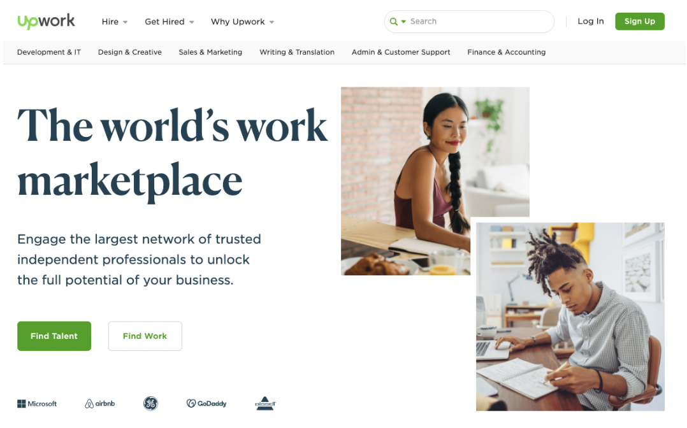
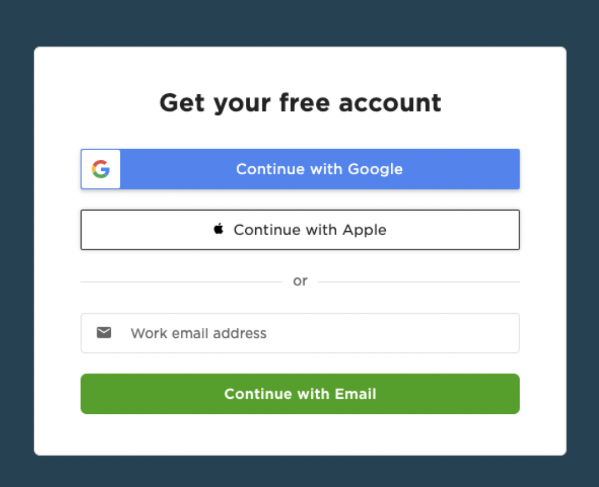

# Profil yaratish

Upwork - dunyodagi eng katta frilanserlik platformalaridan biri hisoblanadi. Platformada kuniga minglar yangi ishlar chop etiladi. Ish haqi esako'p hollarda mahalliy narxdan ancha baland turadi.

Bundan tashqari Upwork frilanserlar uchun ishonchli va nisbatan xavfsiz platforma. Har bir ishlagan soatingiz uchun haq olishingizni Upwork kafolatlaydi. Aynan shu sababli boshqa platformalardan ajralib turadi.

Xo'sh, siz Upwork yaratgan imkoniyatlardan qanday foydalanishingiz mumkin? Bu maqolada, Upworkka sayohatingizni boshlash uchun zarur bo'lgan bilimlarni ulashaman.

Upworkka kirishga tayyormisiz? Unda platformada ro'yhatdan o'tish bosqichlarini ko'rib chiqamiz.

## **1. Upwork.com sahifasiga kiring va “Sign Up”  tugmasini bosing**

Birinchi bo'lib, Upwork.com ga kiring. Sahifa o'ng taraf tepasida turgan "Sign Up" (Ro'yhatdan o'tish) tugmasini bosing.

‍
## **2. Elektron pochtangiz, Apple yoki Google akkountingiz bilan ro'yatdan o'ting**

Upworkda bepul akkount yaratish uchun sizda bir nechta tanlov bor:

* Agar Apple yoki Google akkountingiz bian ro'yhatdan o'tsangiz, username va parolingiz ushbu akkountingiz xotirasida turadi.
* Bundan tashqari, o'z emailingizni kiritib alohida akkount yaratishingiz mumkin. Kiritgan parolingizni yodda saqlang!

‍

## **3. Shaxsiy ma'lumotlaringizni kiriting**

Ro'yhatdan o'tish birinchi bosqichini shaxsiy ma'lumotlaringizni kiritib davom ettiring:

* Ism Sharifingiz
* Akkountingiz uchun parol
* Yashash joyingiz  

"Work as a freelancer" (Frilanser bo'lib ishlash) ni tanlab, [Upwork Xizmat ko'rsatish shartlari](https://www.upwork.com/legal#terms) and [Xavfsizlik siyosati](https://www.upwork.com/legal#privacy)ni o'qib chiqing.  

So'ng, “Create My Account”ni bosib keyingi bosqichga o'ting.

‍  

Upworkda mijoz topishning 2 xil yo'li bor:
* **Mijoz sizni topadi:** Upwork profilingiz orqali yoki [Proyekt Katalog](https://www.upwork.com/services/) orqali (o'z hizmat turlaringizni namoyish qilish uchun platforma qismi).
* **Siz mijozga yozasiz:** Chop etilgan ishga "proposal" yuborish orqali. 

Har ikki holatda ham Upworkda yaxshi sayqallangan profilingiz bo'lishi kerak. Profil siz haqingizda, tajribangiz va taqdim etayotgan hizmat turlaringizni aks ettirishi, hamda mijoz e'tiborini torta olishi kerak. Profilni sayqallash sirlarini biroz keyinroq batafsil o'rganamiz.

Hozircha, Upworkka kirib olish uchun zarur bo'lgan asosiy ma'lumotlarni kiritish yetarli.

## **4. Taqdim etadigan hizmat turlaringizni belgilang**

Upwrokda ish boshlashdan oldin 60% to'ldirilgan akkountingiz bo'lishi lozim:

* Rasmingiz
* Mutahassisligingiz
* O'zingiz haqingizda qisqacha ma'lumot
* Ish tajriba
* Eng kamida 1ta "skill"

Albatta, 100% to'liq profilingiz bo'lishi juda muhim. Ammo buning barini bugun qilishingiz shart emas. Profilingizni keyinvhalik qayta qayta yangilab turishingiz kerak.

Shaxsan men 10martada oshiq profilimni yangilaganman, va yana vaqt o'tishi bilan yana ko'p o'zgarishlar kiritishimga aminman.

Birinchi ikkita savol mutahassisligingiz haqida bo'ladi:

* Bajaradigan ishingiz turi
* Qaysi sohada ishlashingiz
* Tajribangiz 

Siz 4tagacha sohani tanlashingiz mumkin. Men o'zingiz yaxshi biladigan sohani tanlashni maslahat beraman. Keyinchalik Upworkda shu sohada ishlashni boshlaysiz.

10tagacha sohangizga bog'liq bo'lgan bilimlaringizni ko'rsating. Bular bari profilingizda ko'rinadi, shuning uchun siz yaxshi biladigan va sohangizga taaluqlilarini tanlashga harakat qiling.

‍  

Keyingi bosqichda, tajriba darajangizni tanlang: Boshlang'ich, O'rta yoki Yuqori.

‍  

## **5. Ta'lim darajangizni belgilang**

Bu qismda ta'lim darajangizni va shunga oid ma'lumotlarni kiritasiz.  

Maslahat beraman:

* Ta'lim darajangiz, hali tugatmagan bo'lsangiz ham
* O'qiyotgan sohangiz
* Qoshimcha ma'lumotlar (sertifikatlar...)

‍

## **6. Ish tajribangiz haiqda ma'lumot**

Sizning oldingi ish tajribangiz Upworkda mijoz topishingizga katta yordam bera oladi. 

Quyidagilarni kiritishingiz mumkin:

* Olding ishlagan kompaniyalaringiz
* Hozirgacha ishlagan proyektlaringiz
* Boshqa frilanserlik platformalaridagi proyektlaringiz

‍

## **7. Til bilish darajangiz**

Upworkda ingliz tilidagi platforma va ingliz tilini qanchalik bilishingizni profilingizda ko'rsatishingiz majburiy. Ammo, Upworkda mijozlar dunyoniy barcha qismidan bo'lib, boshqa tillarni bilishingiz sizga yanada ko'p imkoniyatlar yaratadi.

Til bilish darajangizni to'g'ri baholang, yolg'ondan darajani ko'tarib qo'yishingiz sizning foydangizga ishlamaydi.

## ‍ **8. Soatlik maoshingizni kiriting**

Agar bu sizga qiyinchilik tug'dirsa quyidagilarni eslang:

* Soatlik maoshni har qanday vaqtda o'zgartira olasiz
* Har bir ishga topshirganda o'sha ish talablaridan kelib chiqib boshqacha narx belgilashingiz mumkin

Yangi frilanserlar yo'l qo'yadigan xatolardan biri kompaniyada oladigan maoshlari bilan bir xil narx qo'yishdir. Endi ish boshlayotganda bu zararli bo'lishi mumkin.

Sizga hozircha boshlang'ich narx tanlab, Upworkda ish tajribangiz oshgach buni ko'tarib borish tavsiya etiladi.

<!-- Learn more about [mistakes independent talent make when setting their rates—and ideas to fix them](https://www.upwork.com/resources/mistakes-independent-talent-make-when-setting-rates). -->

## ‍ **9. Kasbingiz va bu haqida ma'lumot kiriting**

[Yaxshi tanlangan "title" katta ahamiyat kasb eta oladi](https://www.upwork.com/resources/upwork-profiles-why-a-great-title-and-overview-can-make-a-difference). Avvalo, mijoz sizni qaysi so'zlardan foydalanib qidirishini o'ylaylik.

Mijozlarga sizni osonroq topishda qanday yordam bera olasiz? Quyida bir-ikkita maslahatlarni keltirib o'taman:

* **Qisqa "title" tanlang** Eng kerakli ma'lumotni qisqa, lo'nda tarzda bildiring. Uzun "title" mobil qurlmalarda to'liq ko'rinmaydi. 
* **Aniq ifodalang** Mijoz qidiradigan aniq so'zlardan foydalaning.
* **Birinchi gapingiz juda muhim** "Overview" juda muhim, ammo uning birinchi gapi hammasidan muhim va mijozlarga birinchi bo'lib ko'rinadi.

<!--  -->

"Overview" ham juda uzun bo'lmasligi lozim. Qiziq bo'lishi va sizning bilim, ko'nikmalaringizni aks ettirishi kerak.

Quyidagicha yozishingiz mumkin:
Bir-ikki kich paragraflar bilan:
"Bu mening soham... Shuncha tajribam bor... Proyektlarim quyidagilarda iborat... Sizga shu hizmatlarni taklif qilaman...". Qisqa, aniq va tayyor!

‍  

## **10. Profil rasm qo'ying**

To'g'ri rasm tanlash muhim. Nega? Chunki siz yaxshi rasm orqali sizni endi ko'rib turgan mijozda ishonch yarata olasiz.
 

Upworkda rasm qo'yish uchun bir ikki [talablar bor](https://support.upwork.com/hc/en-us/articles/360053305673-Profile-Pictures). Misol uchun:

* Bo'sh bo'lmasligi kerak
* Yuzingiz aniq ko'rinishi lozim
* Logo yoki karikatura ishlatolmaysiz 

Bu yerda profil rasmi uchun Upwork tomonidan [foydali ma'lumotlar berilgan](https://www.upwork.com/resources/how-to-guide-perfect-profile-picture).

‍  

## **11. Siz bilan bog'lanish uchun ma'lumotlarni kiriting**

Bu bosqichda o'z shaxsingizni tasdiqlash uchun bir ikki ma'lumot kiritishingiz so'raladi.

Yashash manzilingizni va telefon raqamingizni kiriting.

‍

## **12. Profilni qayta tekshirib chiqing**

Barcha bosqichlarni tugatdingiz! Endi ma'lumotlaringizni qayta tekshirib, Upworkka jo'nating.

**Diqqat qiling: siz hali ish boshlay olmaysiz**   

Platforma xavfsizligini ta'minlash uchun Upwork sizning profilingizni tekshiradi va ishga topshirishdan oldin o'z shaxsingizni tasdiqlash talab etiladi:

* Passport orqali
* Online video orqali   

Ko'pincha bu bosqich 5-10minut oladi. [Batafsil bu yerda o'qish.](https://support.upwork.com/hc/en-us/articles/360010609234-ID-Verification-Badge)

## **13: Upworkda Frilanser b'ling**

Ta-da! Siz Upworkda birinchi ishingizni boshlashga tayyorsiz.   

Keyingi darslarda profilingizni kuchaytirish va qanday qilib mijozlar e'tiborini tortish haqida gaplashamiz.
‍