# Create a profile

Upwork is one of the largest freelancing platforms in the world. Thousands of new jobs are posted on the platform every day. In most cases, the wages are much higher than the local price.

Moreover, Upwork is a reliable and relatively safe platform for freelancers. Upwork guarantees that you get paid for every hour you work. This is why it stands out from other platforms.

So how can you take advantage of what Upwork has created? In this article, I'll share the knowledge you need to start your Upwork journey.

Ready to join Upwork? Then we will consider the steps of registration on the platform.

## **1. Go to Upwork.com and click Sign Up**

First, log in to Upwork.com. Click the "Sign Up" button at the top right of the page.

‍
## **2. Sign up with your email, Apple or Google account**

To create a free account on Upwork, you have several choices:

* If you register with your Apple or Google account, your username and password will be stored in the memory of this account.
* You can create a separate account by entering your email. Remember the password you entered!

## **3. Enter your personal details**

Continue with the first step of registration by entering your personal information:

* Your name is Sharif
* Password for your account
* Your residential address

Select "Work as a freelancer" and [Upwork Terms of Service](https://www.upwork.com/legal#terms) and [Security Policy](https://www .upwork.com/legal#privacy).

Then click on "Create My Account" to proceed to the next step.

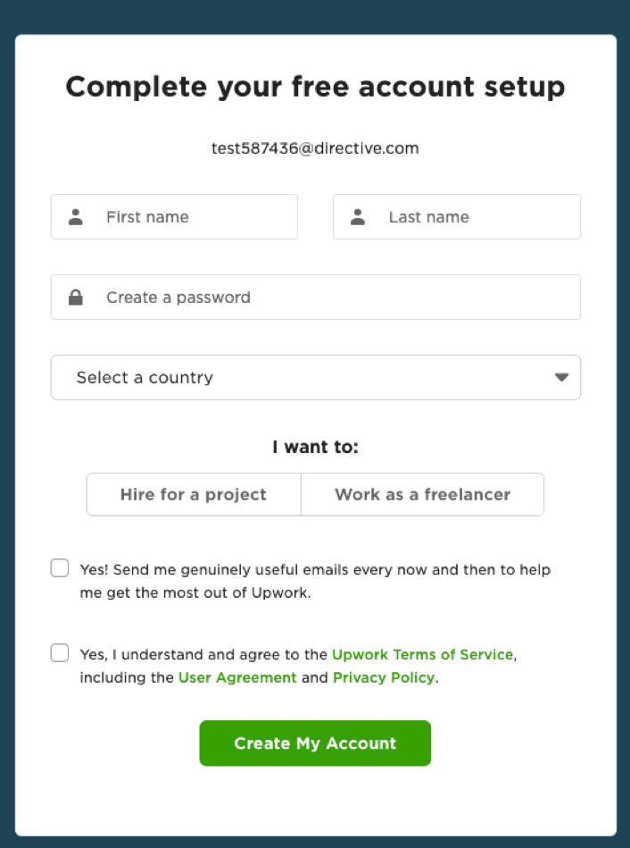

There are 2 different ways to find a client on Upwork:
* **The client will find you:** Through your Upwork profile or through the [Project Directory](https://www.upwork.com/services/) (part of the platform to showcase your services).
* **You write to a client:** By submitting a "proposal" for a printed job.

Either way, you should have a well-polished profile on Upwork. The profile should reflect about you, your experience and the types of services you provide, and should be able to attract the attention of the client. We will explore the secrets of polishing the profile in more detail a little later.

For now, it's enough to enter the basic information you need to log into Upwork.

## **4. Specify the types of services you provide**

Before you can start working on Upwrok, you must have a 60% filled account:

* Your picture
* Your specialty
* Brief information about yourself
* Work experience
* At least 1 "skill"

Of course, it is very important that you have a 100% complete profile. But you don't have to do it all today. You must update your profile again and again.

I personally have updated my profile more than 10 times and I'm sure I will make many more changes over time.

The first two questions will be about your major:

* The type of work you do
* In which field you work
* Your experience

You can choose up to 4 fields. I recommend choosing a field that you know well. You will then start working in this field on Upwork.

Showcase your knowledge in up to 10 fields. All of these will appear on your profile, so try to choose ones that you know well and are relevant to your industry.

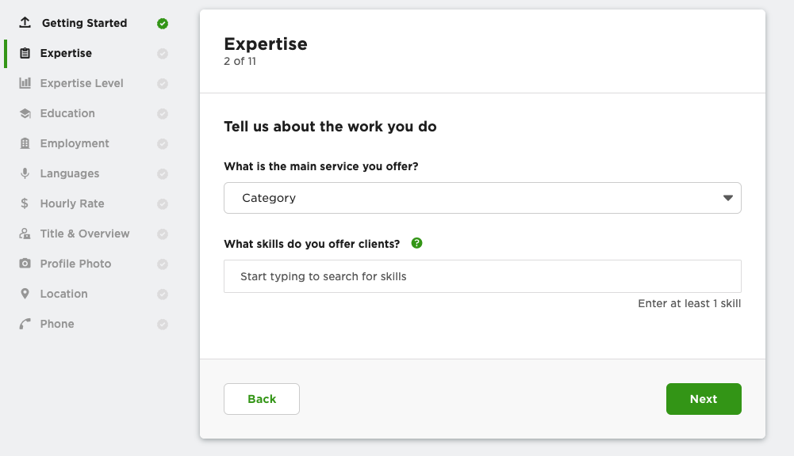

‍

In the next step, select your experience level: Beginner, Intermediate or Advanced.

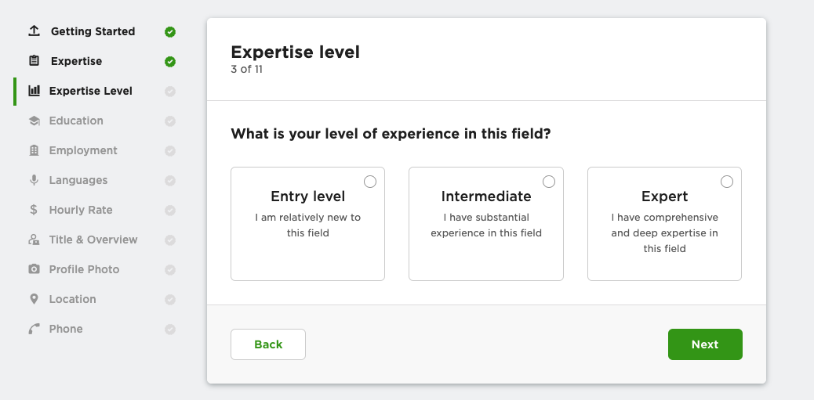

## **5. Specify your education level**

In this section, you enter your education level and related information.

I advise:

* Your level of education, even if you have not yet completed it
* Your field of study
* Additional information (certificates...)

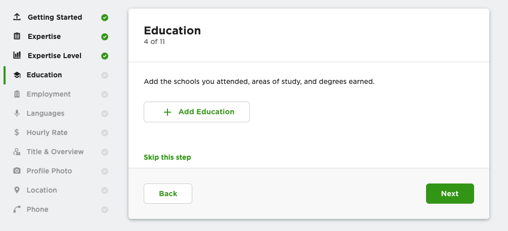

## **6. Information about your work experience**

Your previous work experience can greatly help you find a client on Upwork.

You can enter the following:

* Your previous companies
* Projects you have worked on so far
* Your projects on other freelancing platforms

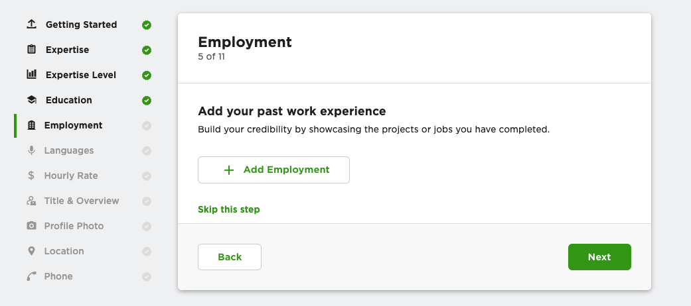

## **7. Your language level**

Upwork is an English language platform and it is mandatory that you show your English proficiency in your profile. However, Upwork has clients from all over the world, so knowing other languages will give you more opportunities.

Assess your language skills correctly, falsely leveling up will not work in your favor.

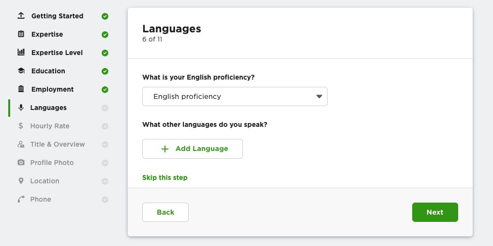

## ‍ **8. Enter your hourly wage**

If you find this difficult, remember the following:

* You can change the hourly wage at any time
* You can set a different price for each job based on the requirements of that job

One of the mistakes new freelancers make is to charge the same price as what they would earn at a company. Now it can be harmful when starting work.

We recommend that you choose a starting price for now and raise it as you gain experience on Upwork.

<!-- Learn more about [mistakes independent talent make when setting their rates—and ideas to fix them](https://www.upwork.com/resources/mistakes-independent-talent-make-when-setting-rates) . -->

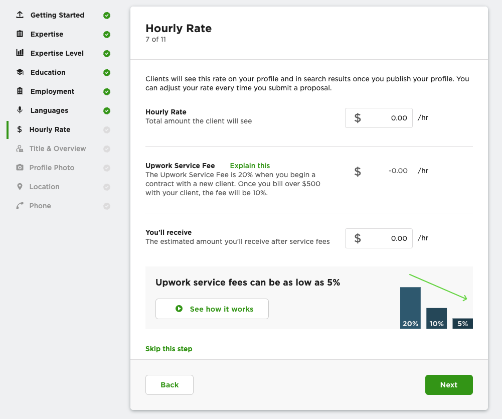

## ‍ **9. Enter your occupation and information about it**

[A great title can make a difference](https://www.upwork.com/resources/upwork-profiles-why-a-great-title-and-overview-can-make-a-difference). First of all, let's think about what words the customer will use to search for you.

How can you help customers find you more easily? Here are a couple of tips:

* **Choose a short title** Convey the most important information in a short, concise manner. The long "title" is not fully visible on mobile devices.
* **Be specific** Use the exact words the customer is looking for.
* **Your first sentence is very important** Overview is very important, but its first sentence is the most important and the first one that customers will see.

<!--  -->

"Overview" should not be too long. It should be interesting and reflect your knowledge and skills.

You can write like this:
With a couple of small paragraphs:
"This is my field... I have so much experience... My projects include the following... I offer you these services...". Short, clear and ready!

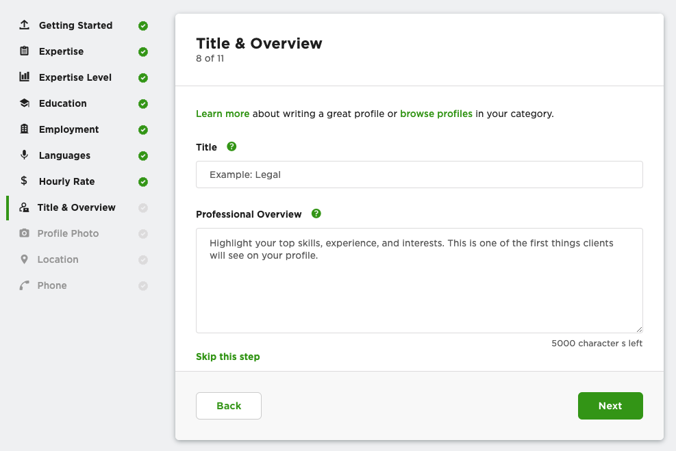

Below you can see the title and overview of my profile:

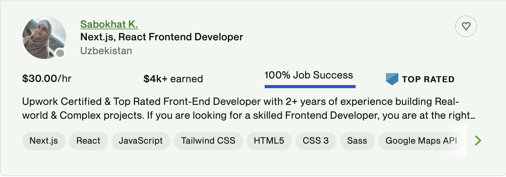

## **10. Add a picture to your profile**

Choosing the right image is important. Why? Because with a good picture you can create trust in the client who sees you now.

Upwork has some [requirements](https://support.upwork.com/hc/en-us/articles/360053305673-Profile-Pictures) for posting pictures. For example:

* Must not be empty
* Your face should be clearly visible
* You cannot use a logo or caricature

Here's [helpful information provided](https://www.upwork.com/resources/how-to-guide-perfect-profile-picture) by Upwork for a profile picture.

## **11. Enter your contact details**

At this stage, you will be asked to enter a couple of details to confirm your identity.

Enter your home address and phone number.

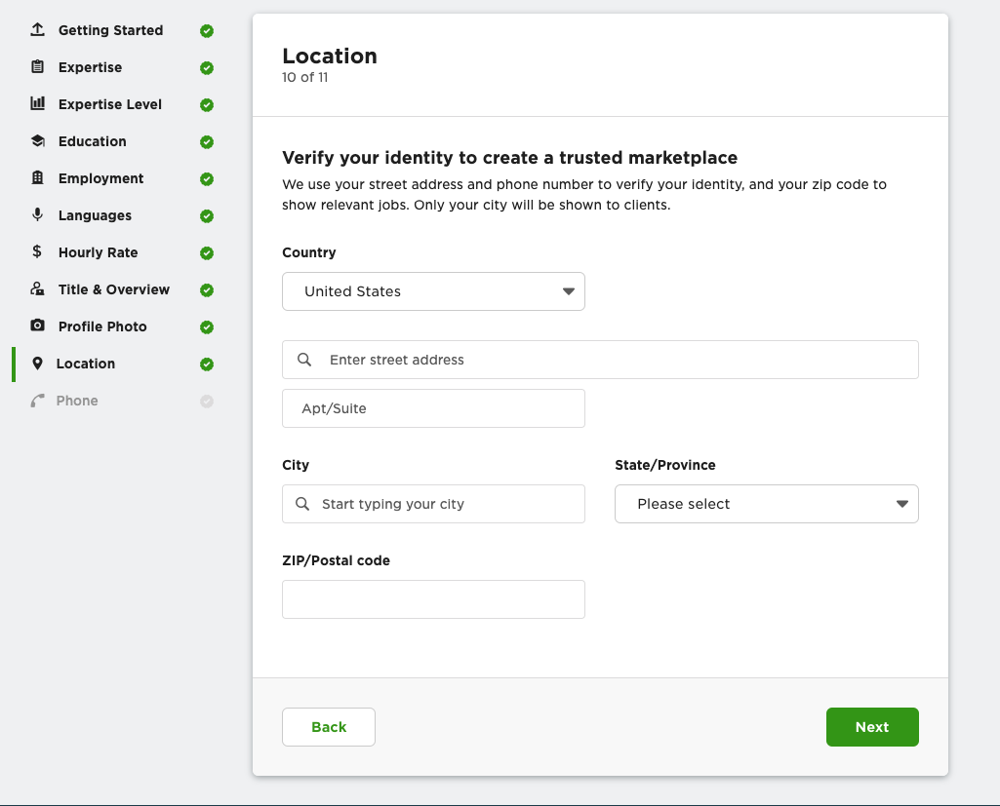

‍

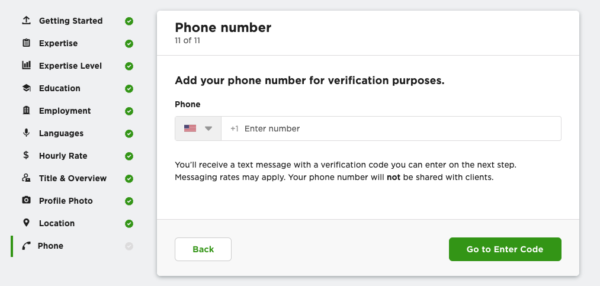

## **12. Please check your profile again**

You have completed all stages! Now recheck your information and submit it to Upwork.

**Note: You can't get started yet**

The platform checks your profile to ensure security and requires verification of your identity before submitting a job:

* By passport
* Via online video

This step usually takes 5-10 minutes. [Read more here.](https://support.upwork.com/hc/en-us/articles/360010609234-ID-Verification-Badge)

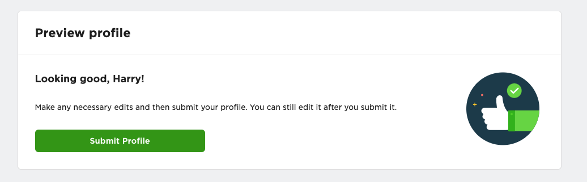

## **13: Become a Freelancer on Upwork**

So you're ready to start your first job on Upwork.

In the next lessons, we will talk about how to strengthen your profile and how to attract the attention of customers.
