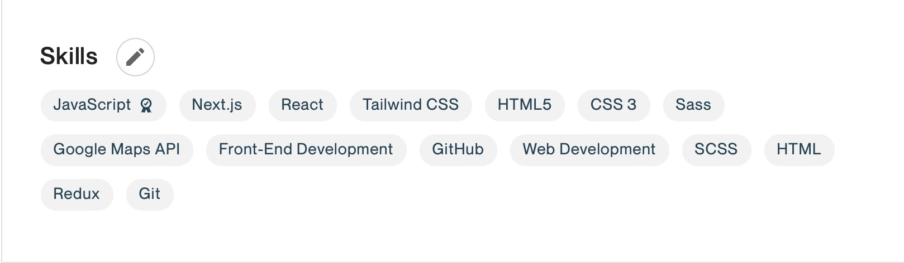
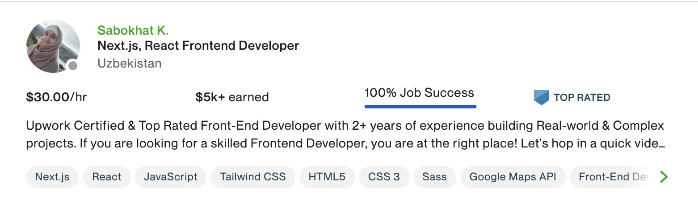

# 9 Upworkda ajralib turadigan profil yaratish sirlari

Professional profil Upworkda juda muhim hisbolanadi. Chunki bu sizni mijozlarga tanishtirish va ularning e'tiborini olishda katta ahamiyatga ega. Profilni to'g'ri to'ldirib, siz mijozda sizga bo'lgan ishonchni oshirasiz va boshqa raqobatdoshlaringizdan ustunlikka ega bo'lasiz. 

Profilni to'g'ri to'ldiridh nafaqat mizojlar e'tiborini tortadi, balki Upwork sizga taqdim etadigan ishlar sizga mosligini ta'minlaydi. Bundan tashqari "Rising Talent" yoki "Top Rated" darajalarini olish uchun muhim hisbolanadi.

Bu safar siz bilan quyidagi ma'lumotlarni ulashaman:
- Yaxshi profil qanday bo'lishi kerak?
- Profilingizda o'z bilimlaringizni ko'rsatish
- To'g'ri profil rasm tanlash
- Profilda bilim va malakangizni aks ettirish
- Ajoyib tanishuv videosi yaratish
- Eng yaxshi ishingizni ko'rsatish
- Sertifikat va yutuqlaringizni ko'rsatish
- Ish tarixingizni yozish
- Profilni mukammal qilish uchun qo'shimcha maslahatlar

Demak, boshladik!

### Yaxshi profil qanday bo'lishi kerak?

Xo'sh biz o'zi qanday profilga ega bo'lishnii hoxlaymiz? Yaxshi profil qanaqa bo'ladi?

Buni bilish uchun Upworkda o'z sohangizdagi boshqa frilanserlar profillarini ko'zdan kechiring. Eng muvaffaqiyatli frilanserlar profillari boshqalardan qanday ajralib turibdi, ahamiyat bering. Shu bilan birga ularga taqlid qilib so'zma-so'z ko'chirishingiz to'g'ri emas. Ammo profilni to'ldirish haqida tushuncha olish uchun bu juda yaxshi imkoniyat.

## 1. Profilingizda o'z bilimlaringizni ko'rsatish

Upworkda [**umumiy bilimlar**](https://www.upwork.com/hire/) bor. Shular ichidan o'ziingizga taaluqlilarini topib, profilingizga qo'shib qo'ying. Bularni to'g'ri tanlash, shu yo'nalishda ish olish imkoniyatingizni oshiradi.

Mening profilimning bilim/qobiliyalar qismi:

15tagacha ko'nikma va bilimlaringizni shu tarzda tanlang. Tanlashda siz qanchalik shu bilimni yaxshi bilishingiz va u sohangizda qanchalik muhimligini hisobga oling.

Bu ro'yxatni keyinchalik, yangi ko'nikmalarni o'zlashtirgach o'zgartirib borishingiz mumkin.

## 2. To'g'ri profil rasm tanlash

Mijoz birinchi bo;lib profil rasmingizni ko'radi, shu sababdan to'g'ri profil rasm tanlash juda muhim. Mana [**bu yerda**](https://www.upwork.com/resources/how-to-guide-perfect-profile-picture) bu haqida qo'shimcha ma'lumotlar bor.

Qisqacha aytganda, profil rasmida bir o'zingiz bo'lishingiz kerak. Rasm tiniq bo'lishi lozim. Bundan tashqari, juda jiddiy va juda kulgili bo'lishi tavsiya qilinmaydi. Yuzingiz to'liq ko'rinishi kerak.

## 3. Profilda bilim va malakangizni aks ettirish

Title tanlashda mijozlar nima qidirishiga ahamiyat bering. Chunki mijozlar qidirgan so'z sizning Title da bo'lsa, siz qidiruv natijalarida ko'rinasiz.

Overwiev yozganda birinchi 2ta gap muhim hisoblanadi, chunki profilingiz qidiruv natijalarida chiqqanda shu boshlang'ich qism ko'rinib turadi. shu sababli eng muhim ma'lumotlar haqida, asosan, tajribangiz haqida overview boshida yozing.

Profil ko'rinishi:

## 4. Ajoyib tanishuv videosi yaratish

Video yaratish sizni boshqalardan ajratib turadi, chunki 90% frilanserlarda video yo'q. Mijozlarga esa siz haqingizda bilish juda qiziq va bu oradagi ishonchi oshiradi. 

Video yaratish qo'rqinchli va qiyin ko'rinishi mumkin. Bu holda gpiradigan gaplarinchizni yozib olishni maslahat beraman. O'z bilimlaringiz, qobiliyatlaringiz haqida gapiring.

Agar motivatsiya kerak bo'lsa:
- [Men birinchi olgan video](https://youtu.be/brvMxvG1A-w)
- Hozirgi Video tanishtiruvim: 
- [Video olishda maslahatlar](https://www.youtube.com/watch?v=eSs68R4zhLI&t=498s)
- [Upwork video tips](https://www.upwork.com/resources/get-your-profile-to-the-next-level-with-an-intro-video)

## 5. Eng yaxshi ishingizni ko'rsatish

Portfolio qismida loyiha va ishlaringizdan namunalar ko'rsating. Bu qism Upworkda endi ish boshlaganlar uchun juda muhim, chunki ko'p hollarda mijozlar sizning oldingi ishingizdan namuna ko'rishni xohlashadi. Eng yaxshi ishlaringizni ko'rsatib mijozda sizga nisbatan ishonchni oshiring.

Bundan tashqari, har bir ishni qanday bajarganingiz, ishdagi qiyinchiliklarni qay tarzda yengib o'tganingiz haqida ham yozing. 

## 6. Sertifikat va yutuqlaringizni ko'rsatish

Sohangizga oid sertifikatlaringizni ko'rsatish uchun profilingizda mahsus bo'lim bor. Sertifikatlarni ko'rsatish orqali qanchalik shu sohani yaxshi bilishingizni isbotlashingz mumkin.

**Pro Tip:** Ko'p mizojlar ingliz tilida ravon so'zlovchi frilanserlarni izlashadi, agar sizda IELTS sertifikati bo'lsa, buni qo'shishni also uunutmang.

## 7. Ish tarixingizni yozish

Oldingi ish joyingiz, vazifalaringiz haqida, albatta, yozib o'ting. Bu mijozga siz haqingizda, tajribangiz haqida ko'proq ma'lumot beradi.

Qisqacha tarzda bajargan vazifalaringiz, ishlagan muddatingiz va lavozimingiz haqida yozsangiz bo'ladi. Ishdagi yutuqlaringiz haqida yozishni ham unutmang.

## 8. Ta'lim darajangiz haqida yozing

Siz o'qigan/'qiyotgan oliygoh, soha va bilimlar haqidagi ma'lumotlarni profilingizda aks ettirishingiz lozim. 

Bundan tashqari, siz bitirgan online kurslar ro'yhatini kiritishingiz ham mumkin.

Agarda tadqiqot ishlarida yoki o'qishdan tashqari mashg'ulotlarda qatnashgan bo'lsangiz, bularni “Other Experiences” qismiga qo'shishingiz mumkin.

## 9. Profilni mukammal qilish uchun qo'shimcha maslahatlar

- Barcha ma'lumotlarni qayta tekshirib chiqing. Hech qanday imlo yoki grammatik xatolae bo'lmasligi lozim.
- Boshqa frilanserlar profillarini ko'rib, o'ingizga yoqqan kichik o'zgartirishlar kiritishingiz mumkin.
- Sohangizga oid ma'lumotlar kiriting. Boshqa ortiqcha yoki chalg'ituvchi ma'lumotlarni oliib tashlang.
- Profil ommaga ko'rinish turishini ta'minlang ("profile visibility" should be "public")
- Profil sozlamalarida boshqa platformalardagi profillaringiz inkini kiriting, bu orqali Upwork qidiruv natijalarida sizni ko'proq chiqara boshlaydi.
- Qo'shimcha "available" badge ni yoqib oling, bu ilk ishni topishda katta yordam beradi.

Profilno chop etishdan oldin, do'stlaringizga ko'rsating va ularning maslahatlarini olgach, kerakli o'zgartirishlarni qiling.
